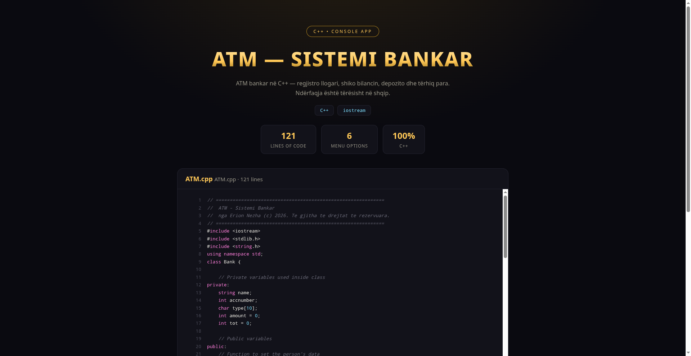

# 🏧 ATM — Sistemi Bankar 🇦🇱

> ATM bankar në C++ — regjistro llogari, shiko bilancin, depozito dhe tërhiq para. Ndërfaqja është tërësisht në shqip.



**🔴 Live demo — shiko kodin:** https://erionnezha.github.io/ATM/


## 📋 Menuja

1. Shkruaj emrin, numrin dhe llojin e llogarisë
2. Shiko të dhënat
3. Depozito para
4. Shiko bilancin total
5. Tërhiq para
6. Dil

## ▶️ Si ekzekutohet

```bash
g++ ATM.cpp -o atm
./atm
```

## 📄 Licenca

Copyright © 2026 Erion Nezha. Të gjitha të drejtat të rezervuara. Shiko [LICENSE](LICENSE).

---

# 🏧 ATM — Banking System 🇬🇧

> ATM banking system in C++ — register accounts, check balance, deposit and withdraw money. The UI is fully in Albanian.

**🔴 Live demo — view the code:** https://erionnezha.github.io/ATM/


## 📋 Menu

1. Enter name, number and account type
2. View account data
3. Deposit money
4. View total balance
5. Withdraw money
6. Exit

## ▶️ How to run

```bash
g++ ATM.cpp -o atm
./atm
```

## 📄 License

Copyright © 2026 Erion Nezha. All rights reserved. See [LICENSE](LICENSE).
